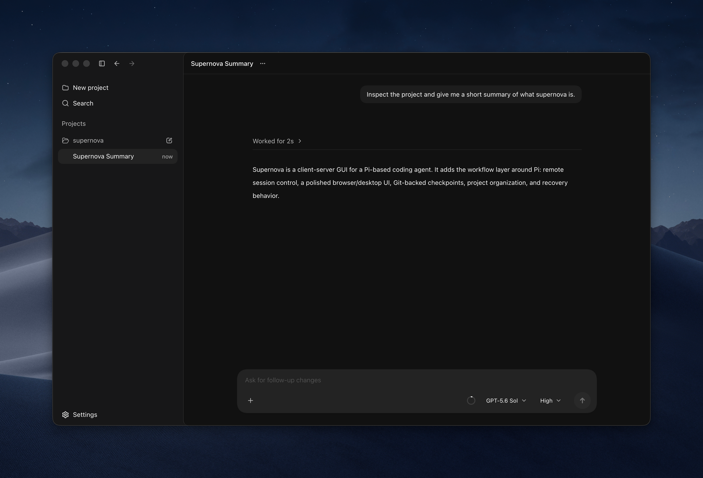

<p align="center">
  
</p>

<h1 align="center">Supernova</h1>

<p align="center">
  <a href="https://github.com/mattiacerutti/supernova/actions/workflows/ci.yml"></a>
  <a href="https://github.com/mattiacerutti/supernova/stargazers"></a>
  <a href="LICENSE"></a>
</p>

<p align="center">
  The fast, opinionated development environment for the <a href="https://github.com/earendil-works/pi">Pi coding agent</a>.
</p>

<p align="center">
  
</p>

> [!WARNING]
> Supernova is pre-release software. Expect breaking changes and rough edges.

Supernova is built for developers who want to move quickly without giving up control.

- **Performance first** — A virtualized timeline and streaming UI stay responsive, even in long sessions.
- **Sleek by design** — A calm, focused interface without the feature sprawl of a general-purpose agent environment.
- **Pi, not a replacement** — Pi remains the execution engine for models, providers, credentials, sessions, and tools.
- **Git-backed navigation** — Move across conversation checkpoints and restore turn-level workspace changes without moving `HEAD` or resetting staged work.
- **Remote-first** — Supernova is designed to run agents where the code lives and control them from anywhere. Remote access is coming soon.

## Install

Download the desktop app for macOS, Linux, or Windows from [GitHub Releases](https://github.com/mattiacerutti/supernova/releases).

> [!NOTE]
> Current macOS builds are unsigned. If macOS blocks Supernova, move it to Applications and run:
>
> ```bash
> xattr -rd com.apple.quarantine /Applications/Supernova.app
> ```

### From source

Requires [Bun](https://bun.sh) 1.3.13 and Git.

```bash
git clone https://github.com/mattiacerutti/supernova.git
cd supernova
bun install
bun run dev:desktop
```

This starts the web client, server, and Electron app. To use Supernova in a browser instead:

```bash
bun run dev:server
```

The development server runs at `http://localhost:5173`.

## Development

```bash
bun run build
bun run lint
bun run typecheck
bun run test
bun run test:e2e
```

Supernova is a Bun/Turborepo workspace:

- `apps/server` — CLI, server, Pi runtime composition, and host capabilities
- `apps/desktop` — Electron shell
- `packages/web` — React browser client
- `packages/agent-runtime` — Pi SDK integration and runtime services
- `packages/contracts` — shared RPC contracts

For architecture and development guidance, see [`docs/`](docs/).

## License

[MIT](LICENSE)
