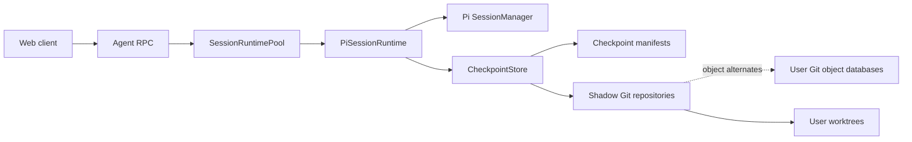
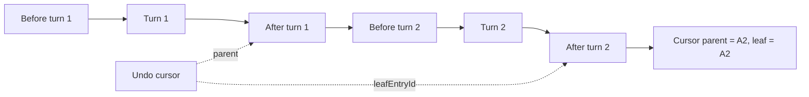
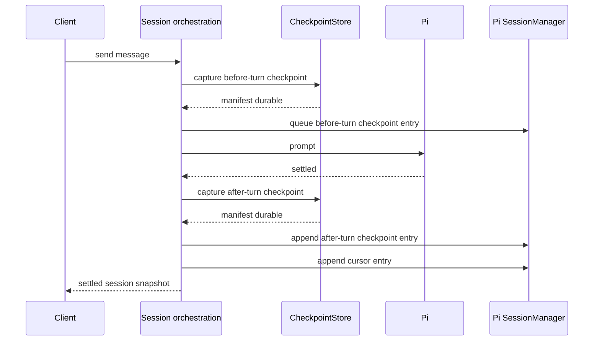
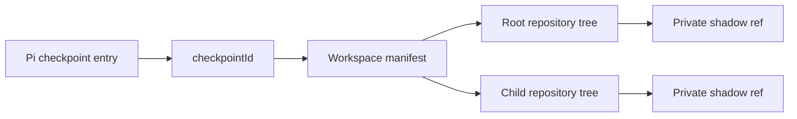
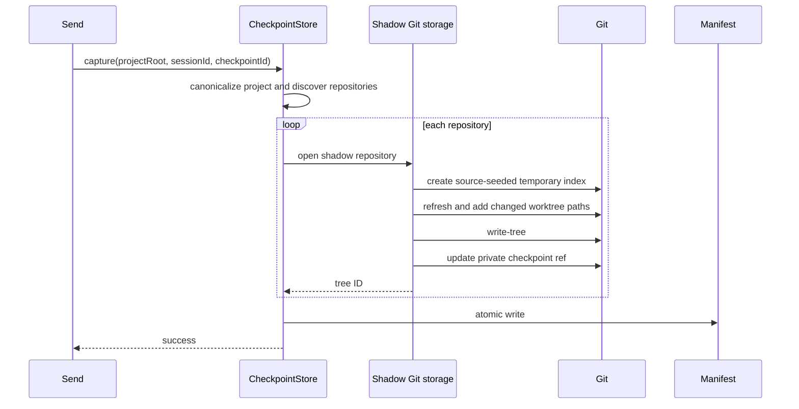
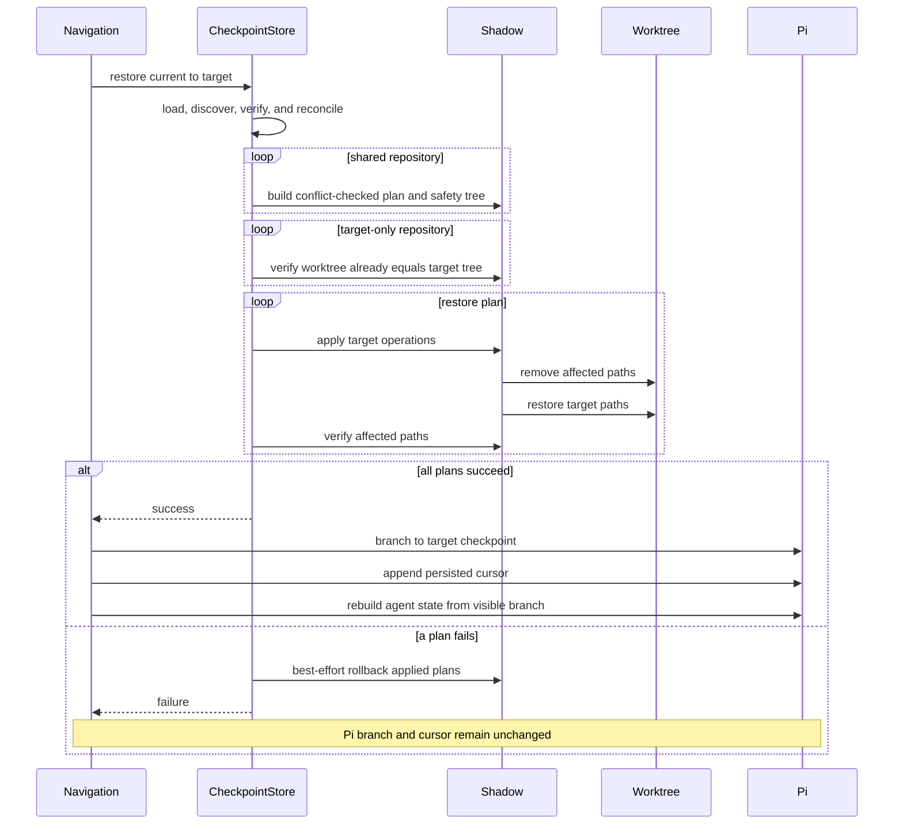

# Checkpoint System Architecture

## Purpose

Supernova checkpoints keep conversation navigation and workspace files at the same logical point in time.

The system coordinates two durable state models:

- Pi's append-only session tree, which stores conversation turns and navigation cursors.
- App-owned shadow Git repositories, which store workspace file snapshots.

A checkpoint navigation succeeds only when the workspace restore completes before the Pi branch and cursor move.

## Architecture overview



The architecture is divided into four responsibilities:

| Subsystem              | Responsibility                                                                                                                                      |
| ---------------------- | --------------------------------------------------------------------------------------------------------------------------------------------------- |
| Session orchestration  | Defines turn boundaries, resolves navigation targets, and commits Pi navigation only after workspace restoration.                                   |
| Workspace coordination | Discovers repositories, persists manifests, and coordinates multi-repository capture, restore, cleanup, and maintenance.                            |
| Shadow Git storage     | Captures trees and performs comparison, conflict detection, selective restoration, verification, rollback, and garbage collection for one worktree. |
| Lifecycle integration  | Releases active runtimes before archival and removes session-owned manifests and refs afterward.                                                    |

## Core invariants

1. A Pi file-checkpoint entry claiming coverage is appended only after its workspace manifest is durable.
2. A checkpoint manifest is published only after every covered repository has a tree and private ref.
3. Workspace restoration completes and verifies before the Pi branch or cursor moves.
4. Restore mutates only paths changed between the current and target checkpoint trees.
5. The user's Git `HEAD`, branch, index, refs, and stash are never changed.
6. A direct child repository owns its subtree; a parent repository snapshot excludes that subtree.
7. Manual changes to affected paths cause restore to fail before mutation unless the caller forces it.
8. Checkpoint storage never writes refs, indexes, commits, or other metadata into the user's `.git` directory.
9. Client-facing checkpoint failures are generic, apart from the workspace-conflict error, and are not logged by the checkpoint boundary.

## Conversation checkpoint model

Supernova stores two Pi custom-entry types.

```ts
interface CheckpointEntryData {
  readonly checkpointId: string;
  readonly phase: "before-turn" | "after-turn";
  readonly status?: "captured" | "disabled" | "failed";
}

interface CheckpointCursorEntryData {
  readonly leafEntryId: string;
}
```

- `supernova.checkpoint` associates a Pi node with a workspace manifest.
- `supernova.checkpoint-cursor` records the visible checkpoint and the redo leaf.
- The cursor entry's parent is the currently visible checkpoint node.
- `leafEntryId` is the end of the branch that remains available for redo.

### Checkpoint coverage

`status` records whether a boundary has a durable workspace manifest behind it.

| Status               | Meaning                                                                 |
| -------------------- | ----------------------------------------------------------------------- |
| `captured` or absent | A manifest exists for `checkpointId`. Absent entries predate the field. |
| `failed`             | Capture failed. No manifest was published.                              |
| `disabled`           | Checkpointing was off for this turn. No capture was attempted.          |

Every turn appends both boundary entries and a cursor regardless of coverage, so turn
boundaries and conversation navigation stay intact when no workspace state was captured.
Workspace restoration requires both the current and target boundary to be captured;
otherwise navigation moves the conversation alone and leaves files untouched.

Both boundaries are required because a selective restore needs both trees: the plan is the
delta between them, and the conflict check compares the worktree against the current tree.
With no current tree there is no delta to compute and no way to separate agent changes from
manual edits, so a captured target cannot be restored on its own.

### Crossing an uncovered boundary

Navigating across an uncovered boundary moves the conversation while the worktree stays
where the turn left it, so conversation position and workspace state diverge. That
divergence is not tracked, and it has two consequences on later navigation:

- The next restore between two captured boundaries compares the worktree against the current
  checkpoint tree. If the uncovered turns changed any path in that delta, the conflict check
  fails and the restore is refused until a new turn re-baselines the workspace.
- If the uncovered turns changed only unrelated paths, the restore proceeds and leaves a
  mixed workspace: the restored delta is reverted while the uncovered changes remain.

Both outcomes are the ordinary conflict semantics applied to a workspace that drifted from
its checkpoint. Neither is reported as an uncovered-boundary problem.



Undo, redo, and revert-to-message resolve different target entries, but all use the same workspace restore operation.

## Turn lifecycle

A successful turn has a checkpoint on both sides of provider work.



Before starting provider work, `sendMessage()`:

1. Opens the Pi session.
2. Generates a checkpoint ID.
3. Captures the before-turn workspace state and records the resulting status.
4. Invalidates an old redo path if the user is branching from an undone checkpoint.
5. Queues the before-turn checkpoint entry on the active turn.

After Pi settles, it:

1. Generates another checkpoint ID.
2. Captures the after-turn workspace state and records the resulting status.
3. Appends the after-turn checkpoint entry.
4. Appends a cursor pointing to the new leaf.
5. Publishes the settled session snapshot.

Capture is best-effort. A failed capture marks that boundary `failed` and the turn continues:
provider work still runs, the after-turn entry and cursor are still appended, and the settled
snapshot is still published. The turn stays navigable, but navigation across that boundary
does not restore files. Because the turn proceeds, a turn started from an undone checkpoint
invalidates the redo path whether or not its capture succeeded.

A workspace with no discovered Git repositories still receives valid manifests with empty `repositories` arrays. Conversation undo, redo, and revert therefore continue to work without changing loose files.

## Repository discovery and identity

Discovery runs on every capture and at the beginning of every restore.

The store inspects:

1. The project root itself.
2. Each immediate child directory of the project root.

A candidate is accepted only when its canonical path is exactly the Git worktree root returned by `git rev-parse --show-toplevel`. Bare repositories and directories merely located inside another repository are not accepted as separate roots.

Each repository identity contains:

```ts
interface RepositoryIdentity {
  readonly root: string;
  readonly gitDir: string;
  readonly objectDir: string;
  readonly repositoryId: string;
}
```

`repositoryId` is the SHA-256 hash of the canonical worktree root, canonical Git directory, and stable filesystem identity of that Git directory. This distinguishes repositories replaced in place and linked worktrees that share objects but have different Git directories.

Discovered repositories are sorted by project-relative root. If a root repository contains a discovered direct child repository, the child root is excluded from the parent's capture and restore path set.

Discovery does not recurse below immediate children. Deeper repositories are not independently checkpointed, and restore refuses recursive deletion of any path containing nested `.git` metadata.

## Storage layout

Checkpoint data lives below the Pi agent data directory. By default this is:

```text
~/.supernova/userdata/agent/checkpoints/
```

When `PI_CODING_AGENT_DIR` is set, its value replaces `~/.supernova/userdata/agent`.

```text
<agent-data>/checkpoints/
  projects/
    <sha256-canonical-project-root>/
      repositories/
        <repository-id>/
          git/
            HEAD
            config
            objects/
              info/
                alternates
            refs/
              supernova/
                <sha256-session-id>/
                  <sha256-checkpoint-id>
      manifests/
        <sha256-session-id>/
          <sha256-checkpoint-id>.json
```

The exact physical ref representation may change after Git packs refs. The logical ref name is stored in the manifest.

### Shadow repositories

Each discovered user worktree has one bare, app-owned shadow repository. It:

- Stores new checkpoint objects and refs.
- Uses the user worktree as the command worktree.
- Uses the source repository's object directory through `objects/info/alternates`.
- Disables automatic Git garbage collection with `gc.auto=0`.
- Applies `core.autocrlf=false`, `core.longpaths=true`, and `core.symlinks=true` to checkpoint commands.

Capture and restore use temporary indexes under the operating-system temporary directory. Capture seeds its temporary index by copying the source index when available, then refreshes that private copy from the actual worktree. This reuses unchanged object IDs and filesystem metadata without introducing a shared mutable checkpoint index or application-level lock. Repositories without a source index fall back to an empty temporary index. The user's index is never used for writes, and temporary indexes are removed after each operation.

The shadow ref points directly to a Git tree; Supernova does not create checkpoint commits.

### Checkpoint manifests

One manifest maps a Pi checkpoint ID to the tree captured for every discovered repository.

```ts
interface RepositoryCheckpointState {
  readonly repositoryId: string;
  readonly relativeRoot: string;
  readonly treeId: string;
  readonly refName: string;
}

interface WorkspaceCheckpointManifest {
  readonly version: 1;
  readonly checkpointId: string;
  readonly sessionId: string;
  readonly projectRoot: string;
  readonly repositories: readonly RepositoryCheckpointState[];
}
```

Manifest files contain metadata only. File contents and modes live in Git objects.



Project, session, and checkpoint identifiers are hashed in storage paths. Manifests retain the original checkpoint ID, session ID, canonical project root, relative repository roots, tree IDs, and logical ref names.

Manifest loading validates:

- Manifest version.
- Requested checkpoint, session, and project ownership.
- Duplicate repository identities.
- Repository and tree hash formats.
- Expected session/checkpoint ref names.
- Project-relative repository paths.

Manifests are written atomically through a temporary sibling file followed by `rename()`.

## Capture

`CheckpointStore.capture()` captures one complete workspace checkpoint.



For each repository, capture:

1. Creates a private temporary index.
2. Copies the source index when available, otherwise initializes an empty tree.
3. Removes discovered child repository roots owned by another snapshot.
4. Clears `skip-worktree` and `assume-unchanged` flags in the temporary copy, then refreshes cached index metadata against the actual worktree.
5. Lists changed tracked paths and untracked, non-ignored paths.
6. Keeps tracked files regardless of size or ignore status.
7. Keeps untracked files and symlinks up to and including 2 MiB.
8. Skips ignored untracked files, untracked files above 2 MiB, directories, and missing paths.
9. Adds only changed, deleted, and eligible untracked paths with literal, NUL-delimited pathspecs.
10. Writes a complete controlled-worktree tree into the shadow object database.
11. Creates the session/checkpoint ref before publishing the manifest.

Tracked deletions are represented by absence from the newly built tree. Empty directories, ownership, ACLs, and extended attributes are not representable by Git trees.

If any repository capture or the manifest write fails, the manifest is not published. The store best-effort deletes refs already created for that incomplete checkpoint and propagates the failure.

## Restore

All navigation commands call:

```ts
restore({
  projectRoot,
  sessionId,
  fromCheckpointId,
  checkpointId,
});
```

The operation has three phases: preflight, apply, and conversation commit.

### Repository-set reconciliation

Restore loads the current and target manifests, rediscovers repositories, and matches entries by `repositoryId` plus `relativeRoot`.

| Relationship                                    | Behavior                                                                                                           |
| ----------------------------------------------- | ------------------------------------------------------------------------------------------------------------------ |
| Present in current and target manifests         | Build a selective restore plan between the two trees.                                                              |
| Present only in the current manifest            | Leave it untouched. The target checkpoint made no claim about it.                                                  |
| Present only in the target manifest             | Require the repository to exist and already match the target tree; do not overwrite without a current source tree. |
| Required by target but missing or replaced      | Fail before mutation.                                                                                              |
| Newly discovered and absent from both manifests | Leave it untouched.                                                                                                |

Currently discovered child repositories are excluded from parent plans even when an older manifest predates the child. Restoring an old parent checkpoint therefore does not delete a repository added later.

Before planning mutations, restore verifies the available manifest refs resolve to their recorded trees.

### Restore plan and conflict detection

For a repository present in both manifests, the shadow layer diffs the current checkpoint tree against the target tree with rename detection disabled.

```ts
interface RepositoryRestorePlan {
  readonly deletePaths: readonly string[];
  readonly restorePaths: readonly string[];
  readonly affectedPaths: readonly string[];
  readonly repository: ShadowRepository;
  readonly safetyTreeId: string;
  readonly targetTreeId: string;
}
```

- Deleted paths exist in the current tree but not the target tree.
- Restore paths are added or modified in the target tree.
- Affected paths are the union of both sets.

The planner builds a safety tree by starting from the current checkpoint tree and replacing only affected paths with their actual worktree state. If that safety tree differs from the expected current tree, an affected path was manually changed and restore fails before mutation with a `CheckpointConflictError`.

Manual changes outside the affected path set are intentionally ignored and preserved.

### Forced restores

Navigation payloads accept `force`. A forced restore skips the safety-tree equality check and
overwrites the conflicting paths, which permanently discards those manual changes; nothing
pins the pre-force worktree state. `force` bypasses that single check and nothing else:
missing or invalid manifests, unresolvable refs, missing or replaced repositories, the nested
`.git` refusal, and post-apply verification all still fail.

Clients are expected to attempt navigation without `force`, and to retry with it only after
the user confirms discarding their changes in response to a `CheckpointConflictError`. The
conflict error names no paths, so the confirmation is a blanket acknowledgement rather than a
review of specific files. The workspace can also change between the refusal and the retry;
`force` discards whatever conflicts at the moment it runs.

### Applying and verifying



Application removes both delete and restore paths before running `git restore --worktree`. Removing first handles file-to-directory and directory-to-file transitions.

Before recursive removal, the implementation:

- Rejects unsafe or escaping repository paths.
- Resolves and checks filesystem containment.
- Refuses to traverse a symbolic-link ancestor.
- Refuses to remove a path containing nested `.git` metadata.

Only restore paths are read back from the target tree. Delete paths remain absent.

Verification starts from the target tree, replaces affected paths with their actual post-restore worktree state, writes a verification tree, and requires its ID to equal the target tree ID. This verifies content, executable modes, symlinks, additions, and deletions for affected paths.

### Best-effort rollback

Each plan's safety tree records the actual affected-path state during preflight, before any plan is applied. If apply or verification fails, plans that may have been touched are processed in reverse order and restored from their safety trees.

Safety trees are not referenced after the restore call and are eventually eligible for Git pruning. Rollback protects ordinary in-process failures; it does not make multi-repository restore transactionally atomic or crash-safe.

### Conversation commit

`navigateToCheckpoint()` calls `PiSessionRuntime.restoreCheckpoint()` before mutating Pi state, and only when both the current and target boundaries are captured. Only after restore succeeds, or is skipped because a boundary is uncovered, does it:

1. Branch the Pi `SessionManager` to the target checkpoint entry.
2. Append a checkpoint cursor preserving the redo leaf.
3. Rebuild the in-memory model, thinking level, and provider messages from the visible branch.
4. Publish the restored session snapshot.

A restore failure is converted to `Failed to restore workspace checkpoint.` The Pi branch and cursor do not move.

## Git and filesystem preservation

| State                                           | Behavior                                      |
| ----------------------------------------------- | --------------------------------------------- |
| User `HEAD` and current branch                  | Preserved.                                    |
| User commits, branches, tags, refs, and reflogs | Preserved.                                    |
| User index and staged state                     | Preserved.                                    |
| Git stash                                       | Preserved.                                    |
| Paths in the current-to-target tree delta       | Restored or deleted after conflict checks.    |
| Paths outside that delta                        | Preserved.                                    |
| Ignored untracked files                         | Not captured and not restored.                |
| Untracked files through 2 MiB                   | Captured when inside a discovered repository. |
| Untracked files above 2 MiB                     | Not captured.                                 |
| Tracked files                                   | Captured without a size limit.                |
| Loose files outside discovered repositories     | Not captured or restored.                     |
| Empty directories                               | Not represented.                              |
| Executable mode and symlinks                    | Captured and restored.                        |
| Ownership, ACLs, and extended attributes        | Not represented.                              |
| Nested `.git` metadata                          | Never recursively deleted by restore.         |

## Errors

Checkpoint storage uses ordinary exceptions internally.

At session boundaries:

- Capture failures are absorbed and recorded as a `failed` checkpoint boundary instead of failing the turn.
- Workspace conflicts become `CheckpointConflictError`, the one non-generic checkpoint failure, so clients can offer a forced retry. It carries a fixed message and no paths.
- Every other restore failure becomes `CheckpointGenericError` with `Failed to restore workspace checkpoint.`
- Internal Git commands, paths, tree IDs, and manifest details are not sent to clients.
- Checkpoint failures are not logged by the checkpoint system.

`CheckpointNavigationError` is the union of those two and is the declared error for the undo,
redo, and revert procedures. Navigation operations throw ordinary exceptions; the runtime
service boundary wraps each command in `Effect.tryPromise` and classifies whatever was thrown
with `asCheckpointNavigationError()`. That is the single place a navigation failure becomes a
client-facing error.

The store uses `Promise<void>` rather than booleans so callers cannot accidentally treat a failed capture as a valid checkpoint. `PiSessionRuntime.createCheckpoint()` converts that rejection into a boundary status, which is the only place a capture failure is interpreted.

## Session archival and cleanup

Archiving a session follows this order:

1. `AgentRpcLive` releases and disposes the session runtime.
2. The Pi session file moves into the archive directory.
3. `CheckpointStore.deleteSession()` runs as best-effort cleanup.

Session cleanup:

1. Loads that session's manifests.
2. Deletes each recorded session/checkpoint ref from its shadow repository.
3. Removes that session's manifest directory.
4. Leaves shared shadow repository directories in place.
5. Schedules maintenance if the daily interval has elapsed.

Cleanup never deletes another session's refs or automatically removes a shared shadow repository.

## Maintenance and retention

Automatic Git GC is disabled in every shadow repository. The production store installs one unref'ed daily timer per storage root and also checks the same interval after capture and session cleanup.

Maintenance walks initialized shadow repositories and runs:

```sh
git gc --prune=7.days
```

Properties of this policy:

- Trees reachable from retained session refs remain protected.
- Objects unique to deleted checkpoints become unreachable after ref deletion.
- Unreachable objects older than seven days may be reclaimed.
- `--prune=now` is never used.
- Fresh objects created before a capture ref is published have a seven-day safety window.
- Maintenance failures are silently ignored and retried on a later interval.
- No application-level cleanup lock is used.

Objects available only through the source repository alternate remain dependent on the source repository retaining them. Rewriting source history followed by aggressive source GC can therefore make an old checkpoint incomplete even while its shadow ref remains.

## Concurrency and lifecycle

`SessionRuntimePool` retains one `PiSessionRuntime` per active session. Runtime work tracking prevents disposal from tearing down a Pi session while accepted work is still settling:

- `beginWork()` creates a completion boundary.
- `endWork()` releases it.
- `dispose()` aborts active work, including work still opening its Pi session, waits for completion, unsubscribes, and disposes the Pi session.
- Session archival releases the runtime before moving the session file or deleting checkpoint refs.
- Runtime-layer shutdown disposes all retained runtimes.

The checkpoint store serializes capture and restore per canonical project root with an
in-process keyed lock. Concurrent sessions in the same project queue instead of observing
each other mid-operation, so a capture never records a partially restored worktree and two
restores never interleave worktree mutations. Different projects remain fully concurrent,
and session cleanup is not serialized because ref deletion and manifest removal are
independent of worktree state.

The lock is process-local and project-scoped. It does not protect against a second
Supernova process, against two overlapping project roots that share one worktree, or
against agent tool writes that run outside checkpoint operations.

## Accepted limitations

- A process crash during restore can leave a partially restored workspace.
- Restore is not atomic across repositories.
- There is no startup restore journal or recovery pass.
- There is no cross-process lock, and agent tool writes are not serialized against checkpoint operations.
- Discovery includes only the project root and immediate child repositories.
- Loose files outside discovered repositories are ignored.
- Untracked files larger than 2 MiB are ignored; tracked files remain uncapped.
- Empty directories, ownership, ACLs, and extended attributes are not captured.
- Source object alternates make some checkpoint objects depend on source repository retention.
- Existing checkpoint data formerly stored in user repositories is not migrated or read.
- Uncovered checkpoint boundaries are not surfaced to clients, so a turn without workspace coverage looks like any other turn.
- There is no configurable storage budget or checkpoint-management UI.
