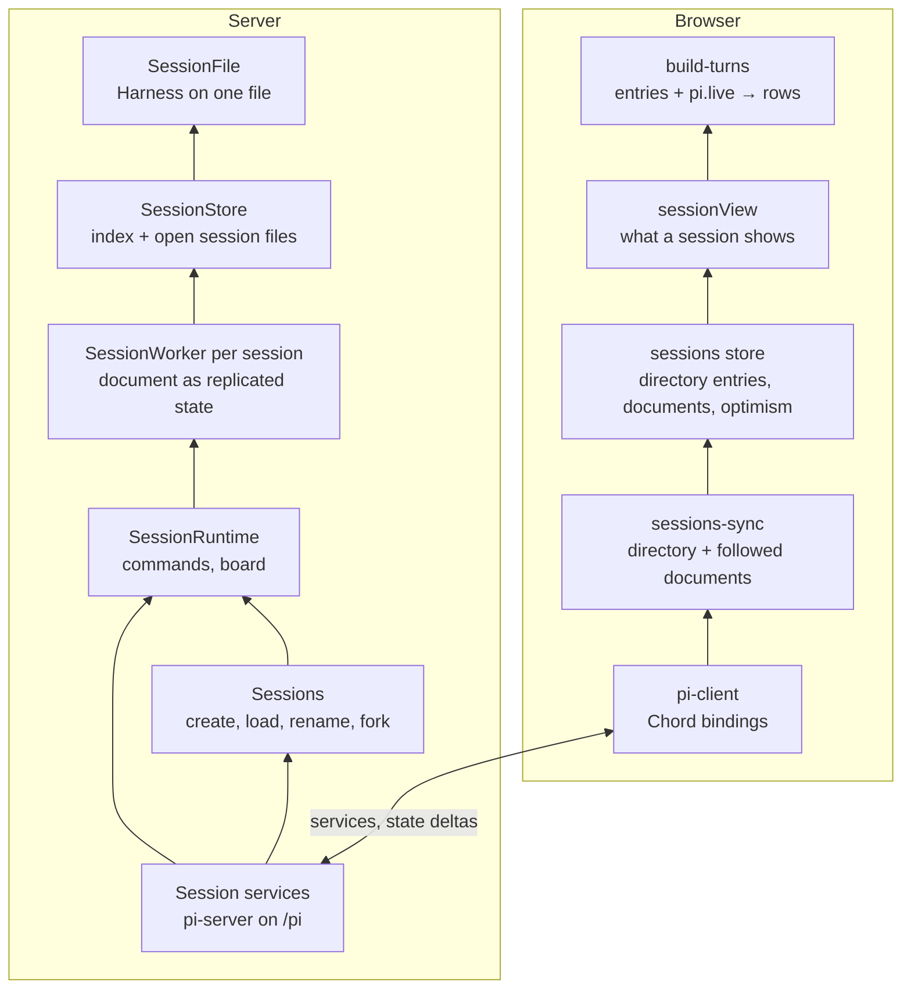

# Session runtime

## Summary

A session is Pi's state: its entries (the transcript) and its documents (`pi.agent`, `pi.live`, `pi.usage`), plus what Supernova adds (turn records, title, worktree, context usage). The server keeps one such document per session, the contract `Session`, as Chord replicated state, and serves it with the session's commands as Chord services over Pi's service protocol. The browser attaches the session it shows, receives each change to the document as a delta, and builds its timeline from it, the way Pi's TUI renders from `Conversation.viewState()`.

There is no separate committed and live view: the active run is part of the state (`live.run`, `live.generation`, `runStart`), and the browser decides how to show it. Execution is owned by Pi's durable engine (`@earendil-works/pi-durable`): every streamed partial, tool output, and turn is committed to the session's file before it is shown, so a server restart resumes an interrupted run instead of losing it.

This document explains the design, its guarantees, and the reasoning behind its boundaries. It is intended for contributors working on sessions, streaming, checkpoints, the session services, or timeline behavior.

## Goals

1. **Server-owned execution.** Agent work continues independently of the browser that started it, and across server restarts.
2. **Parallel sessions.** Different sessions run at the same time without sharing lifecycle state or storage.
3. **Single-run consistency.** A session runs one input at a time; sends while busy are rejected today (queueing is designed in, see below).
4. **Pi's shapes end to end.** The browser receives Pi's documents unchanged and entries enriched with authored `contentParts`; mapping them to rows is rendering, done in the browser.
5. **Responsive streaming.** Each engine commit reaches the browser as a delta of what changed, not a copy of the running turn.
6. **Predictable failure behavior.** Disconnecting a client, stopping a run, and rejecting a command have distinct outcomes.

## Non-goals

- client-owned or browser-local agent execution
- durable replay of every stream event to clients
- multi-client fencing beyond what attachments provide

## Storage

Each Supernova session is one SQLite file, `<agentDir>/sessions-v2/<sessionId>/session.sqlite`, opened by one Harness. The session's chat starts as the file's root conversation; undo moves a pointer into it, and the next send forks there inside the same file (see [Checkpoint system](checkpoint-system.md)). One file per session follows Pi's own durable coding agent: a storage failure is fatal only to its own file, sessions never contend on one commit line, and idle sessions can close.

`<agentDir>/sessions-v2/catalog.sqlite` holds every session's record (project, worktree, title, fork source, pin, archive time), one row each (`pi/lib/session/session-catalog.ts`). Lookup by id, listing by project, and title search read only the catalog; no session file is opened for any. The engine cannot list by project, so the catalog is ours.

Listings and searches are paged on the server. Two partial indexes over unarchived rows hold them in order: `(project_path, pinned DESC, updated_at DESC, id DESC)` for a project's listing, and `(updated_at DESC, id DESC)` for search, which filters titles with an escaped `LIKE` while it walks it. A page is a keyset query that continues after the last row's sort key, read from the index without sorting; its cursor is that key, opaque to clients. The id breaks ties, so a page boundary never skips or repeats a row. The schema version is SQLite's `user_version`; a catalog from any other version is refused.

Both use Node's `node:sqlite`: session files through pi-durable's `openNodeSqliteStorage`, the catalog directly.

Sessions written by the old SDK (`<agentDir>/sessions/`) are ignored: they are not listed, read, or changed, and their files stay where they are.

## Architecture

`pi/session-store.ts` is the seam onto the engine; features never import `pi-durable`. Contracts import Pi's types (type-only) so the browser sees Pi's shapes; `z.custom<PiType>()` carries those values unchecked.

| State                                      | Owner                                     | Lifetime        |
| ------------------------------------------ | ----------------------------------------- | --------------- |
| Transcript, runs, tasks                    | Engine session file                       | Durable         |
| Turn records, navigation                   | `supernova.session` document in that file | Durable         |
| Session records                            | `catalog.sqlite`                          | Durable         |
| Session document                           | `SessionWorker`                           | Server process  |
| Activity, summaries, problems              | `SessionBoard`                            | Server process  |
| Mirrored directory and documents, optimism | Zustand sessions store                    | Browser process |

## Services

Two services carry sessions, one per feature: `SessionsService` (`contracts/src/services/sessions/services.ts`) and `SessionRuntimeService` (`contracts/src/services/session-runtime/services.ts`). The host is `agent-runtime/src/runtime-services.ts`, served by `pi-server` with every other runtime service on the HTTP server's `/ws` WebSocket (`apps/server/src/runtime-socket.ts`).

| Scope            | Service                 | Members                                                                                                            |
| ---------------- | ----------------------- | ------------------------------------------------------------------------------------------------------------------ |
| Connection       | `SessionsService`       | `directory` (every open session's activity, summary, setup step, last problem), `create`, `fork`, `rename`, `get`, |
|                  |                         | `listModels`, `listComposerSuggestions`, `attach`, `detach`                                                        |
| Attached session | `SessionRuntimeService` | `session` (the session document), `sendMessage`, `compact`, `abort`, `undoCheckpoint`, `redoCheckpoint`,           |
|                  |                         | `revertToMessage`                                                                                                  |

`directory` is written by session runtime (`SessionBoard`) but served on `SessionsService`, because a client reads it before attaching anything; `attach` and `detach` are pi-server's routing, there for the same reason.

A connection attaches one session at a time, as Pi's protocol routes it: the server validates the attachment of every session runtime call, so a delayed frame of a previous attachment cannot reach the new one. The browser attaches the session it shows and reads others (a sidebar prefetch) with `get`.

Expected failures are results, not errors: the protocol carries only its own error codes, so a method returns `{ok: false, error: {code, message}}` with the contract error's tag, and the client branches on the tag (`CheckpointConflictError` offers a forced retry).

## The session document

`SessionStore.snapshot()` builds the `Session` from the branch's current view, split at the leaf: its history through the leaf in append order (compacted entries included, system prompt entries left out), the entries past the leaf as `undone`, `pi.agent` as of the leaf, `pi.live`, `pi.usage`, authored `contentParts` attached to user entries in both history and `undone`, `runStart`, and the context usage of a request from the leaf (`Conversation.context(context, at)`, patched into pi-durable until earendil-works/pi#10513 ships). The durable turn records and their checkpoints stay server-side; there is no separate public turns map. Entries are read only up to the view's newest one, so a final answer never appears beside the partial `pi.live` still streams. Entries are append-only, so a rebuild reads only entries after the last one it has while the branch is unchanged; moving the leaf reads nothing.

`runStart` is the first user entry of the active run. Pi's `pi.live.run` lists the run's input submissions, not entries; the server resolves them so the browser knows where the turn being answered starts.

## Streaming

`SessionWorker` holds the session document as Chord replicated state (`lib/document-state.ts`). Every engine frame of the branch, and every change no frame shows (a rename, navigation, a placed input's turn record), rebuilds it, diffs it against the previous one with Chord's `diffRevisions`, and publishes the change as one revision. A frame only triggers a rebuild of the current state, so a frame handled late never moves the document backwards. The board follows the document's activity (`idle`, `running`, `compacting`, from `pi.live`) and summary, for sessions a client has not attached.

Chord owns replication from there: a subscription starts with a snapshot, later revisions arrive as deltas encoded per client, and a client that falls behind gets a full reset. A reconnecting client attaches again and starts from a new snapshot; nothing is versioned by hand.

Submitting runs inside the worker's publication queue: the engine places the user entry and the turn record is written in a second commit, and no revision may be published between them, or the browser would show a user entry without its record.

## Running a turn

`sendMessage` selects and checks the model, prepares the prompt and images, forks at an undone leaf, configures the branch's model, captures the before-turn checkpoint, and submits the input; a busy session rejects it. It resolves once the engine placed the input; the run continues under the engine. The title is generated alongside and published with the document and the board.

When a frame shows no active run, the worker captures the after-turn checkpoint of every turn that lacks one: one capture serves all inputs a run answered, and runs that finished while nothing watched (after a restart) are caught up on first watch.

The browser shows the message it sent at once as a pending turn, until the send resolves. The worker publishes the placed input's turn before the send's reply leaves, so the document already holds the turn when the pending one goes; the wire test asserts this order. It projects entries before `runStart` as settled turns and entries from it on, plus `pi.live` (streamed partial, running tool output, blocking compactions), as the live turn (`lib/timeline/turns/build-turns.ts`). A streaming partial's last tool call shows no arguments: they may be cut. The engine commits partials at most every 100 ms, so intermediate states may be coalesced.

### Queueing and steering

Not exposed yet. The engine supports it (`whenBusy: "steer" | "followUp"` on submit, the queue in `pi.inbox`, withdrawal), and busy state already comes from the engine's run state. Exposing it means a `whenBusy` field on `sendMessage`, `pi.inbox` in the session document, a withdraw call, and writing a queued input's turn record and before-turn checkpoint when the engine places it rather than at submit (`TODO(queue)` in `SessionFile.submit`).

### Settings

`pi/config/harness-settings.ts` maps Pi's file settings onto Harness settings read at every use: compaction, retry, stream timeouts, transport, queue modes. Thinking budgets and the websocket timeout, which the engine's stream options lack, are added to every request by the `Models` wrapper in the same file. Shell path and command prefix configure command execution. The durable `read` tool does not support image files; images attached in the composer are still sent to the provider. Background compaction is off (`TODO(pi-durable)` in `harness-settings.ts`): the old SDK never compacted in the background and the timeline has no design for it.

## Concurrency

Different sessions run independently. Within a session the engine runs one input at a time; navigation and manual compaction reject while a run is active or another command runs. Route changes in the browser never interrupt server work.

## Failure and recovery

- **Command rejection.** Failures while selecting the model, preparing, or admitting the input fail the command with a `GenericError` result. The browser drops its pending message.
- **Run failure.** A model error is an assistant error entry, shown in the turn. An input that ends unanswered for another reason sets the session's problem on the board.
- **User abort.** `abortSession` aborts the branch's work; the run ends through the normal path and the document shows what was produced.
- **Browser disconnect.** Releases that connection's attachment only. On reconnect the browser rebinds its services, attaches the shown session again, and refetches every cached session.
- **Server shutdown or crash.** Closing the server closes every session file without aborting work. On the next open the engine resumes the run from its last commit: an interrupted tool call that is not replay-safe gets an interrupted result, and the turn finishes. Turns that finished without an after-turn checkpoint get one when their session is next watched.
- **Extension reload.** Updating extensions reinstalls them on every open session in place; a running call finishes on the code it took.

## System invariants

1. The server's session document is the only source of session state; the browser changes it only with values of its replicated state or a read.
2. Replicated state reaches a client as a snapshot and then contiguous deltas; Chord resets a client that cannot follow.
3. A user entry and its authored `contentParts` appear in the same revision.
4. Every visible state was committed to the session file first.
5. One session runs one input at a time; sessions run concurrently.
6. Unsubscribing a client never aborts server-owned work; closing a session never aborts it either.
7. A session call reaches only the attachment it was made for.
