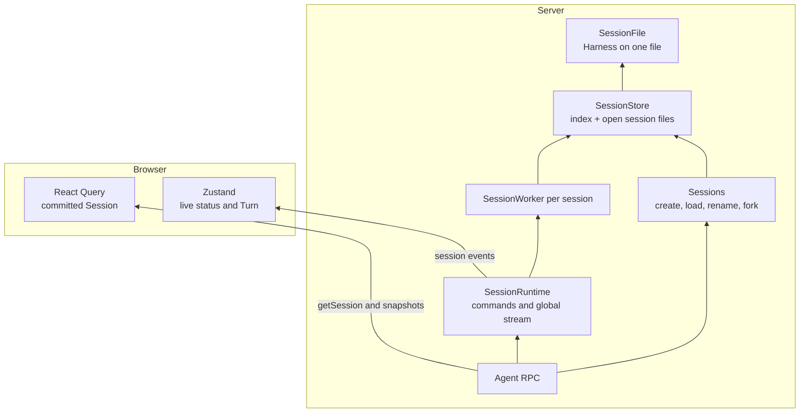

# Session runtime

## Summary

Supernova treats a session as a conversation with two distinct views:

- a **committed view** containing work that has crossed a server commit boundary
- a **live view** containing the single run currently being produced

The server owns both views. The browser renders them together, but it does not decide what is committed and it does not own agent execution.

This separation lets a user start work in one session, switch to another, and come back without interrupting either run or showing the active message twice. Execution itself is owned by Pi's durable engine (`@earendil-works/pi-durable`): every streamed partial, tool output, and turn is committed to the session's file before it is shown, so a server restart resumes an interrupted run instead of losing it.

This document explains the design, its guarantees, and the reasoning behind its boundaries. It is intended for contributors working on sessions, streaming, checkpoints, RPC, or timeline behavior.

## Goals

1. **Server-owned execution.** Agent work continues independently of the browser that started it, and across server restarts.
2. **Parallel sessions.** Different sessions run at the same time without sharing lifecycle state or storage.
3. **Single-run consistency.** A session runs one input at a time; sends while busy are rejected today (queueing is designed in, see below).
4. **Stable committed reads.** Loading a session during a run never imports the active run into committed history.
5. **Responsive streaming.** The UI receives complete live-turn projections as the engine commits progress.
6. **Authoritative settlement.** A final server snapshot, rather than client reconciliation, commits a turn.
7. **Predictable failure behavior.** Disconnecting a client, stopping a run, and rejecting a command have distinct outcomes.

## Non-goals

- client-owned or browser-local agent execution
- durable replay of every stream event to clients
- multi-client fencing beyond what the event stream's revisions provide

## Storage

Each Supernova session is one SQLite file, `<agentDir>/sessions-v2/<sessionId>/session.sqlite`, opened by one Harness. The session's chat starts as the file's root conversation; undo forks inside the same file (see [Checkpoint system](checkpoint-system.md)). One file per session follows Pi's own durable coding agent: a storage failure is fatal only to its own file, sessions never contend on one commit line, and idle sessions can close.

`<agentDir>/sessions-v2/index.json` maps session ids to their record (project, worktree, title, fork source, archive time). Lookup and project listing read only the index; no session file is opened to list. The engine cannot list by project, so the index is ours.

Under `bun run dev:server` the server runs on Bun, which has no `node:sqlite`; `pi/lib/session/sqlite-storage.ts` adapts `bun:sqlite` to the engine's SQLite facade. Electron and the packaged server run Node.

Sessions written by the old SDK (`<agentDir>/sessions/`) are read-only: `pi/lib/session/legacy-sessions.ts` lists and renders them; mutating commands reject. Conversion into the engine is a `TODO(legacy-convert)` there.

## Architecture

`pi/session-store.ts` is the seam onto the engine; features never import `pi-durable`.

| State                        | Owner                                     | Lifetime        |
| ---------------------------- | ----------------------------------------- | --------------- |
| Transcript, runs, tasks      | Engine session file                       | Durable         |
| Turn records, navigation     | `supernova.session` document in that file | Durable         |
| Session index                | `index.json`                              | Durable         |
| Event revisions              | `SessionWorker`                           | Server process  |
| Committed browser session    | React Query                               | Browser cache   |
| Live browser status and turn | Zustand session live store                | Browser process |

## Running a turn

`sendMessage` selects and checks the model, prepares the prompt and images, configures the visible conversation's model, captures the before-turn checkpoint, and submits the input; a busy session rejects it. It resolves once the engine placed the input; the run continues under the engine. The title is generated alongside and published as `session.updated`.

The worker watches the visible conversation's committed view (`Conversation.viewState()`) and translates it:

- `pi.live.run` appearing publishes `session.agent.started`; disappearing publishes `session.agent.ended`, records the after-turn checkpoint, and publishes `session.snapshot`.
- While a run is active, every changed projection publishes `session.turn` with the **full current live turn**: the run's committed entries (from its first user entry on, read from the full history so a mid-run compaction does not cut them) plus `pi.live`'s streamed partial, running tool output, and blocking compactions. The client replaces its live turn with each one; there is no client-side merge.
- A blocking compaction in `pi.live.compactions` brackets `session.compaction.started`/`ended`.

Persisted and live turns go through the same mapper (`pi/lib/turns/build-turns.ts`) over a neutral `TimelineEntry`, which the engine's entries, `pi.live`, and the legacy reader all map onto.

Partial tool-call arguments are hidden until the call is complete: the last tool call of a streaming partial shows no input. The engine commits partials at most every 100 ms, so intermediate states may be coalesced.

### Committed reads

`getSession` builds the session from the visible conversation's history **before the active run's first user entry**, plus undone turns from the leaf. While a run is active, its context usage is reported as unknown. This is the committed/live boundary; it needs no frozen copy because the engine's run state says exactly which entries belong to the run.

### Queueing and steering

Not exposed yet. The engine supports it (`whenBusy: "steer" | "followUp"` on submit, the queue in `pi.inbox`, withdrawal), and busy state already comes from the engine's run state. Exposing it means a `whenBusy` field on `sendMessage`, the queue in the live state, a withdraw call, and writing a queued input's turn record and before-turn checkpoint when the engine places it rather than at submit (`TODO(queue)` in `SessionFile.submit`).

### Settings

`pi/config/harness-settings.ts` maps Pi's file settings onto Harness settings read at every use: compaction, retry, stream timeouts, transport, queue modes. Thinking budgets and the websocket timeout, which the engine's stream options lack, are added to every request by the `Models` wrapper in the same file. Shell path, command prefix, and image resizing are applied by the tools. Background compaction is off (`TODO(pi-durable)` in `harness-settings.ts`): the old SDK never compacted in the background and the timeline has no design for it.

## Concurrency

Different sessions run independently. Within a session the engine runs one input at a time; navigation and manual compaction reject while a run is active or another command runs. Route changes in the browser never interrupt server work.

## Failure and recovery

- **Command rejection.** Failures while selecting the model, preparing, or admitting the input reject the command RPC. The browser removes its optimistic live turn.
- **Run failure.** A model error is an assistant error in the turn. An input that ends unanswered for another reason publishes `session.error`.
- **User abort.** `abortSession` aborts the visible conversation's work; the run settles through the normal path and the final snapshot shows what was produced.
- **Browser disconnect.** Removes that subscriber only. On reconnect the browser refetches committed state; a running session publishes its next frame on the next commit.
- **Server shutdown or crash.** Closing the server closes every session file without aborting work. On the next open the engine resumes the run from its last commit: an interrupted tool call that is not replay-safe gets an interrupted result, and the turn finishes. Turns that finished without an after-turn checkpoint get one when their session is next watched.
- **Extension reload.** Updating extensions reinstalls them on every open session in place; a running call finishes on the code it took.

## System invariants

1. `getSession` excludes the active run's entries.
2. The active run lives only in `session.turn`/`liveTurn` until settlement.
3. `session.snapshot` is the browser's authoritative commit boundary.
4. React Query is the only browser owner of the committed `Session`.
5. Every visible state was committed to the session file first.
6. One session runs one input at a time; sessions run concurrently.
7. Unsubscribing a client never aborts server-owned work; closing a session never aborts it either.
8. Stale or duplicate session events cannot move client state backwards.
