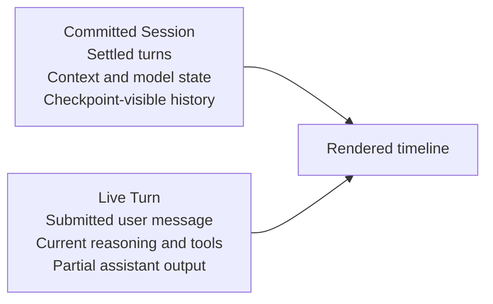
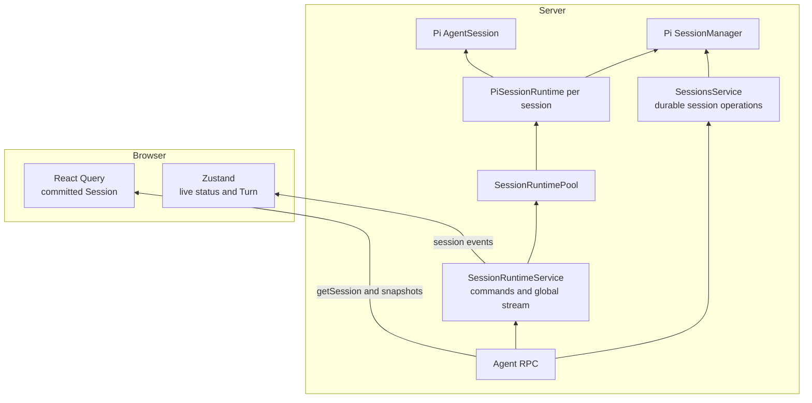
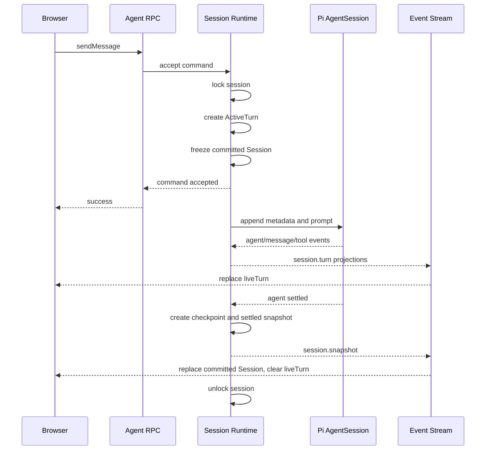
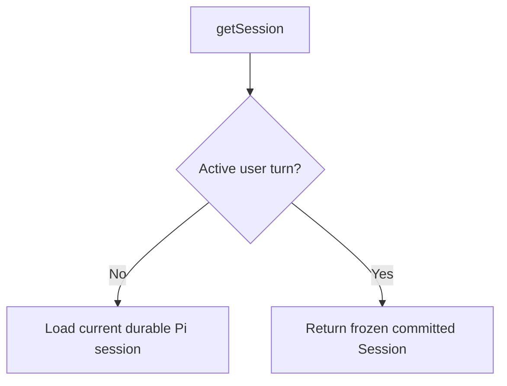
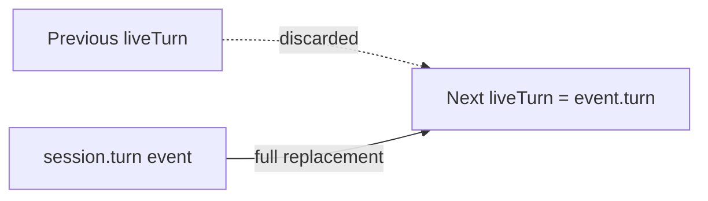
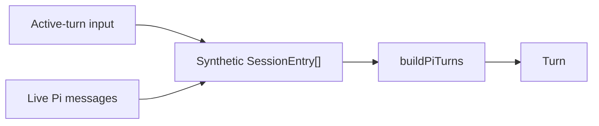
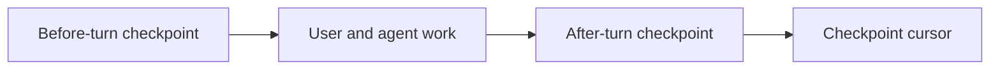

# Session runtime

## Summary

Supernova treats a session as a conversation with two distinct views:

- a **committed view** containing work that has crossed a server commit boundary
- a **live view** containing the single turn currently being produced

The server owns both views. The browser renders them together, but it does not decide what is committed and it does not own agent execution.

This separation allows a user to start work in one session, switch to another, and later return without interrupting either run or showing the active message twice. It also gives the system a clear recovery rule: ordinary reads repair committed state, while stream events describe transient work.

This document explains the design, its guarantees, and the reasoning behind its boundaries. It is intended for contributors working on sessions, streaming, checkpoints, RPC, or timeline behavior.

## Goals

The session runtime is designed to provide:

1. **Server-owned execution.** Agent work continues independently of the browser that started it.
2. **Parallel sessions.** Different sessions may run at the same time without sharing lifecycle state.
3. **Single-turn consistency.** A session accepts only one mutating command at a time.
4. **Stable committed reads.** Loading a session during a run never imports the active turn into committed history.
5. **Responsive streaming.** The UI receives complete live-turn projections as Pi produces messages and tool activity.
6. **Authoritative settlement.** A final server snapshot, rather than client reconciliation, commits a turn.
7. **Predictable failure behavior.** Disconnecting a client, stopping a run, and rejecting a command have distinct outcomes.

## Non-goals

The current design does not attempt to provide:

- multiple simultaneous turns within one session
- durable replay of every stream event
- client-owned or browser-local agent execution
- stable identity between synthetic live entries and persisted Pi entries
- a generic distributed event-sourcing system

Those capabilities would require different contracts and should not be inferred from the existing event stream.

## Conceptual model

### A session is not one mutable object

Pi persists sessions as append-only trees. While an agent is running, Pi may append the user message and subsequent entries before Supernova considers the turn committed. Reading the current Pi branch at that moment therefore produces a mixture of settled and in-progress data.

Supernova avoids exposing that mixture by maintaining two projections:

The committed session remains stable throughout an active turn. The live turn may be replaced many times as new events arrive. When the run settles, a server snapshot replaces the committed session and the live turn disappears.

### Terminology

**Pi session**
: The durable append-only session tree managed by Pi's `SessionManager`.

**Runtime session**
: The server-owned coordinator for one Supernova session. It owns the long-lived Pi `AgentSession`, command lock, live subscription, and event revision.

**Committed session**
: The last session state that Supernova allows ordinary `getSession` reads to observe.

**Active turn**
: Command-scoped, in-memory state for the user message currently being processed.

**Live turn**
: The serializable `Turn` projection produced from the active turn and sent to clients.

**Session snapshot**
: A full authoritative `Session` emitted after a command settles. It is the commit boundary for the browser.

## Architecture

### Authority boundaries

| State                         | Owner                         | Lifetime                        |
| ----------------------------- | ----------------------------- | ------------------------------- |
| Persisted session tree        | Pi `SessionManager`           | Durable                         |
| Agent execution               | Server `PiSessionRuntime`     | Server process                  |
| Active-turn projection        | Server `ActiveTurn`           | One accepted user turn          |
| Committed browser session     | React Query                   | Browser cache                   |
| Live browser status and turn  | Zustand session live store    | Browser process                 |
| Session event revisions       | One retained server runtime   | Runtime lifetime                |
| Global client event transport | Server event bus + web bridge | One server/browser subscription |

No full committed `Session` is duplicated into the live Zustand store. This is a deliberate source-of-truth rule, not a storage preference.

## Runtime lifecycle

### Runtime creation and retention

The server keeps a `SessionRuntimePool` keyed by session ID. A runtime is created when the first runtime command targets that session. The current pool has no idle eviction, so the runtime remains retained for the lifetime of that server runtime.

This gives each retained session:

- one long-lived Pi `AgentSession`
- one Pi event subscription
- one monotonically increasing event revision
- one command lock
- at most one active turn

The pool is what allows session A and session B to work concurrently while preventing two overlapping commands inside session A.

### Starting a user turn

The important part of starting a turn is establishing the committed/live boundary before Pi mutates its branch.

The command RPC confirms acceptance; it does not remain open for the entire provider run. Work continues under the server runtime after the response returns.

### Freezing committed state

At turn activation, the runtime builds and retains a committed `Session` before appending the new prompt entries. While that turn is running, the public `getSession` RPC returns this frozen session instead of remapping Pi's currently mutating branch.

This is a read-consistency boundary. It is not another durable store. The frozen value exists only for the active command and is released when work ends.

Without this boundary, switching away from a streaming session and back could cause a query refetch to place the active user message in committed history while the same message remains in the live turn.

### Streaming

The runtime subscribes to Pi once and translates Pi lifecycle events into Supernova session events. The active turn accumulates the Pi messages needed to represent the current user turn.

A `session.turn` event contains the **full current live turn**, not a patch. Clients replace their previous live turn with the event payload.

This costs more bandwidth than granular deltas, but it makes event handling deterministic:

There is no client-side merge algorithm for reasoning, assistant text, or tool calls.

### Settlement

The runtime waits for Pi's public settlement boundary before committing. It then:

1. records the after-turn workspace checkpoint
2. updates the checkpoint cursor
3. rebuilds the session from Pi's durable branch
4. publishes `session.snapshot`
5. releases active command state

The browser applies the snapshot to React Query and clears `liveTurn`. The active turn is now represented only by committed history.

## Active turns and synthetic entries

### Why synthetic entries exist

Supernova uses one shared mapper, `buildPiTurns`, to convert Pi session entries into timeline turns. During streaming, however, some Pi messages exist only in the active runtime and not yet as a settled durable branch.

Rather than maintain a second live-only turn mapper, the runtime adapts live messages into an in-memory synthetic Pi branch:

This keeps live and persisted rendering semantics aligned. Tool calls, reasoning, assistant messages, attachments, and compaction all pass through the same normalization logic.

### Properties of synthetic entries

Synthetic entries are:

- display projections only
- held in memory
- never appended to `SessionManager`
- never written to the Pi session file
- assigned deterministic but non-persisted IDs

Their IDs must not be used as durable turn or checkpoint identities. Once the turn settles, Supernova rebuilds it from real Pi entries.

### Synthetic user anchors

Pre-prompt compaction may start before Pi emits the submitted user message. The runtime inserts a synthetic user anchor so the request remains visible during that interval. This anchor disappears naturally when a later full live-turn projection replaces it.

### Tool and compaction normalization

Partial tool-call arguments are intentionally removed from streaming assistant updates. The runtime records full validated arguments when Pi emits `tool_execution_start`.

Live compaction uses a temporary synthetic compaction entry. It is completed when Pi supplies a result or removed if compaction does not produce one.

## Event model

### Public event categories

The global stream carries all session runtime activity:

| Category   | Events                                                   | Purpose                                  |
| ---------- | -------------------------------------------------------- | ---------------------------------------- |
| Connection | `connected`                                              | Marks a newly opened watch stream        |
| Agent      | `session.agent.started`, `session.agent.ended`           | Provider-run lifecycle                   |
| Live data  | `session.turn`                                           | Replaceable active-turn projection       |
| Commit     | `session.snapshot`                                       | Authoritative committed session          |
| Compaction | `session.compaction.started`, `session.compaction.ended` | Explicit compaction phase                |
| Metadata   | `session.updated`                                        | Title and session-summary changes        |
| Failure    | `session.error`                                          | Accepted command failed during execution |

The contract also defines `heartbeat` and `server.disposed`, but the current server does not emit them. Do not build liveness or shutdown behavior around those variants without adding a producer and tests.

Every session-scoped event includes a session ID and a revision. Revisions are monotonic within one retained runtime, not global across sessions or server restarts.

A per-runtime publish queue preserves revision order even though Pi event callbacks initiate asynchronous publication.

### Why one global stream

The browser may show activity for sessions that are not currently open. A single global stream allows sidebar status, background work, and the active conversation to stay synchronized without creating one subscription per mounted page.

Each event is routed by `sessionId`, so switching routes changes presentation but not server execution or stream ownership.

### Stream recovery

The event bus is an in-memory broadcast channel; it does not replay missed events.

On a new connection, the browser invalidates committed session queries. This repairs durable state through ordinary RPC reads. If a user turn is still active, the runtime's frozen committed view prevents that repair from leaking live branch entries into committed history.

Transient browser reconnects retain existing live Zustand state and continue with later revisions. A fresh browser that connects in the middle of a quiet run may not reconstruct the full active turn until Pi emits another live event. Durable replay or an active-runtime bootstrap would be a separate feature.

## Client state model

The browser combines two owners rather than copying state between them.

### React Query

React Query owns:

- committed turns
- undone turns
- title and model metadata
- context usage
- the session query lifecycle

`getSession` results and `session.snapshot` events update this cache.

### Live Zustand store

The live store owns only ephemeral runtime state per session:

- current `liveTurn`
- runtime status
- latest event revision
- current runtime error

It does not own a second committed `Session`.

### Event bridge

The session event bridge owns:

- the single global subscription
- reconnect scheduling
- stale connection protection
- event routing
- committed query-cache writes for snapshots and metadata

Separating transport lifecycle from the Zustand store keeps the store focused on state transitions and session commands.

## Concurrency model

### Across sessions

Different runtimes are independent. Session A may stream while session B compacts or processes another turn.

### Within one session

A runtime accepts one command at a time. This serializes:

- sends
- manual compaction
- checkpoint undo and redo
- revert-to-message operations

The browser also disables conflicting actions optimistically, but the server lock is authoritative.

### Client switching

Changing routes:

- does not interrupt the global event subscription
- does not dispose the server runtime
- does not abort provider work
- may remount and refetch the committed session query

The frozen committed read is what makes that final refetch safe during streaming.

## Checkpoints and branch navigation

Pi sessions are append-only trees. Supernova adds workspace checkpoints around each accepted user turn:

Undo, redo, and revert operations move the visible Pi branch. In a Git project they also restore only paths changed between the current and target private checkpoint trees; they do not move `HEAD`, reset staged state, or use stash. In a non-Git project, conversation navigation still works but files are not restored. The browser may update the visible conversation optimistically, but the operation is complete only when the server publishes a new authoritative snapshot.

Sending a replacement message invalidates the previous redo path before the new turn starts.

## Failure and recovery

### Command rejection

Failures while opening the session, selecting a model, or preparing the turn reject the command RPC. The browser removes its optimistic live turn and restores any optimistic committed changes.

### Runtime failure after acceptance

Once work is accepted, failures are reported as `session.error`. The browser clears live state and keeps the last committed query state. The runtime releases the per-session command lock in all cases.

### User abort

`abortSession` is the only client action that explicitly cancels provider work. It targets one retained runtime and does not tear down the Pi session or event subscription. The run settles through the normal runtime boundary so persisted output can be represented by a final snapshot.

### Browser disconnect

A browser disconnect only removes that subscriber. Server work continues. Reconnection repairs committed state through query invalidation and resumes consumption of new events.

### Server shutdown

Process shutdown ends active provider work and loses in-memory active turns, revisions, and event history. Pi entries already written and Git checkpoint objects survive. The current stream does not publish a graceful shutdown event, and restart recovery is based on durable Pi state rather than replaying the interrupted runtime.

## Design decisions and tradeoffs

### Full live projections instead of deltas

**Decision:** publish the complete active turn on each `session.turn` event.

**Benefit:** replacement semantics are simple, deterministic, and resilient to missed intermediate updates.

**Cost:** repeated reasoning and assistant content increases stream payload size.

### Frozen committed reads instead of client deduplication

**Decision:** prevent `getSession` from returning the active turn.

**Benefit:** committed/live ownership remains correct at the source. The UI needs no correlation IDs, content matching, or deduplication heuristics.

**Cost:** the runtime temporarily retains one additional immutable session projection while a user turn is active.

### Synthetic entries instead of a second mapper

**Decision:** adapt live messages into the existing Pi-entry mapping pipeline.

**Benefit:** live and settled turns follow the same normalization rules.

**Cost:** synthetic identities are temporary and cannot be treated as durable Pi identities.

### One global non-replaying stream

**Decision:** use one lightweight broadcast stream and repair committed state with queries.

**Benefit:** background sessions require no route-owned subscriptions or durable event log.

**Cost:** a fresh client cannot reconstruct every active detail without a later event or a future runtime bootstrap mechanism.

## System invariants

Changes to this system should preserve the following:

1. The public `getSession` result excludes the active user turn.
2. The active user turn lives only in `session.turn`/`liveTurn` until settlement.
3. `session.snapshot` is the browser's authoritative commit boundary.
4. React Query is the only browser owner of the committed `Session`.
5. Synthetic entries never enter the durable Pi session tree.
6. One runtime accepts one mutating command at a time.
7. Different session runtimes may execute concurrently.
8. Unsubscribing a client never aborts server-owned work.
9. Stale or duplicate session events cannot move client state backwards.
10. Persisted checkpoint and turn identities never depend on synthetic live IDs.
